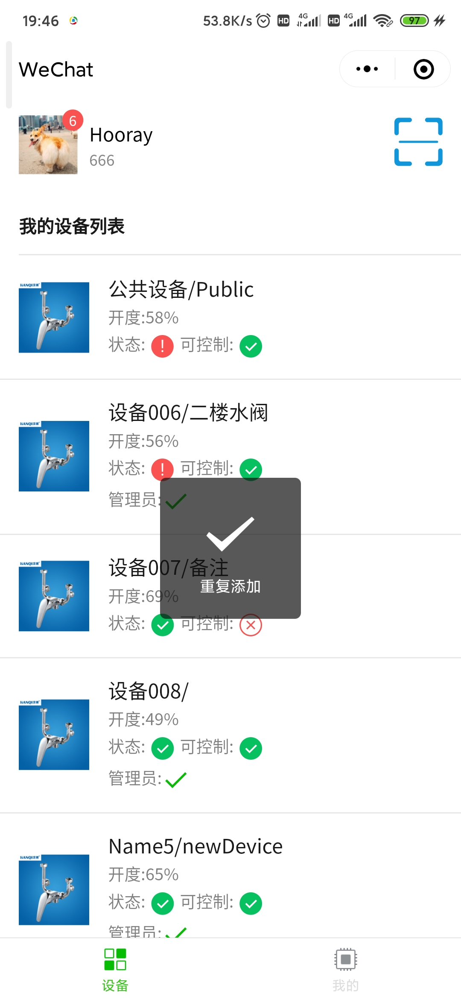
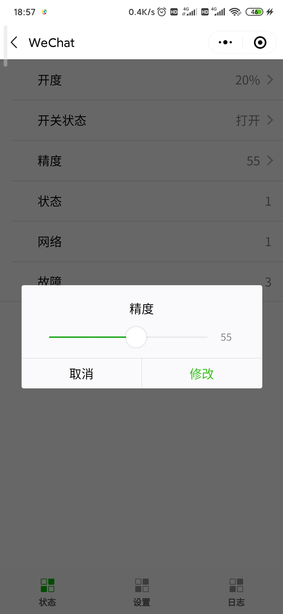
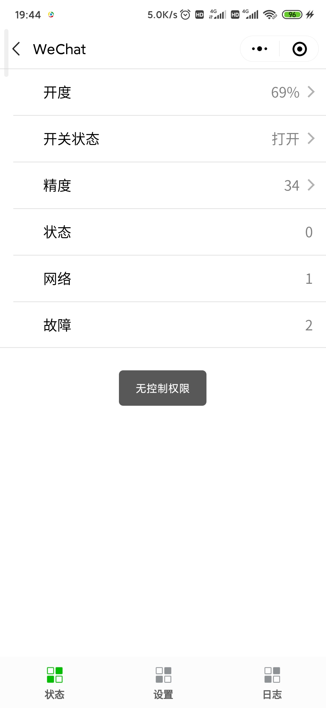
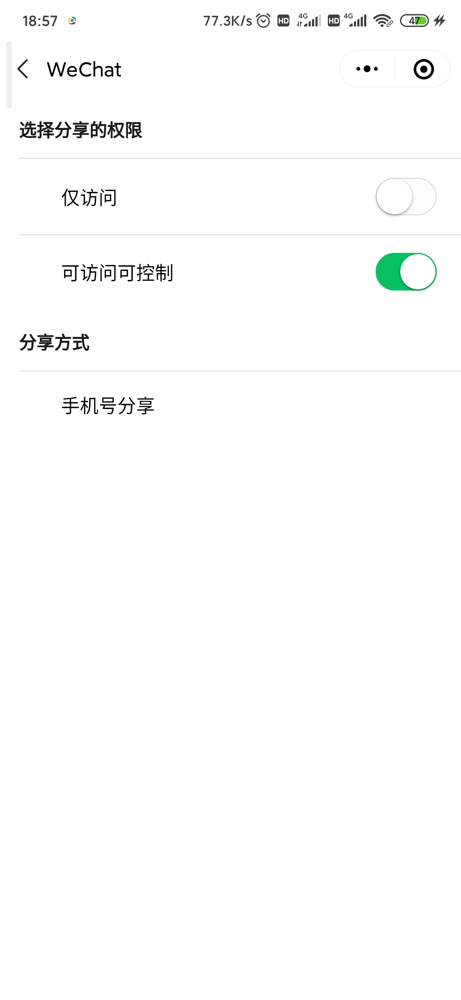
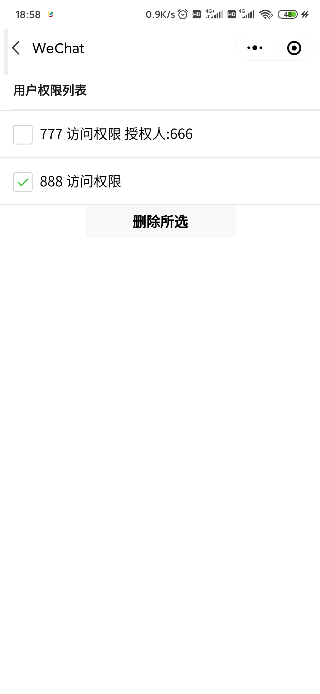

# 智能水阀微信小程序

## 截图

## 小程序功能设计

1. 多人对多设备的添加和访问。
	1. 每个人登陆到小程序后都可以绑定自己的手机号，然后通过扫码或者其他人分享的的方式绑定一些设备。
	1. 对于绑定的所有的设备，该用户都有对设备的访问权限，可查看的信息有：
		1. 设备开度（0-100%）
		1. 远控开关（打开/关闭)
		1. 控制精度（0-100）
		1. 运行状态
		1. 网络状态
		1. 故障信息
		1. 设备名和设备备注信息
		1. 设备序列号
		1. 设备日志
2. 多人对多设备的控制能力。
	1. 对于对设备有控制权限的用户，他们可以修改设备的一些参数和配置信息，并且可以生成相应的日志。
	1. 多人对同一设备的修改会互相同步，并且如果权限被取消了也会在修改前进行判断，以此保证逻辑的准确性。
	1. 有控制权限的用户可以修改的参数有：
		1. 设备开度（0-100%）
		1. 远控开关（打开/关闭)
		1. 控制精度（0-100）
		1. 设备名和设备备注信息
3. 管理员的特殊权限。
	1. 绑定设备的第一个人成为该设备的管理员，拥有该设备的所有权限。
	1. 管理员可以开启设备的访问控制开关。
		1. 默认设备初始状态都未开启访问控制开关的，未开启访问控制开关的设备可以被所有绑定的用户修改。
		1. 如果管理员开启访问控制权限，所有用户只有通过管理员分享控制权限或者输入控制密码才能再次获得对该设备的控制权限。
	1. 管理员可以管理修改设备的控制密码。
		1. 其他只拥有访问权限的用户可以通过控制密码来或者设备的控制权限。
		1. 但该控制权限不可以分享。
		1. 如果管理员修改了设备的控制密码，那么其他通过密码获得控制权限的用户将会失去控制权限。
4. 多人对绑定设备的共享能力。
	1. 所有人都可以对设备进行分享。
	1. 但只有管理员可以分享控制权限，其他人只可以通过手机号分享访问权限。
	1. 被分享的用户可以继续将访问权限分享给其他人。
5. 设备的权限管理能力。
	1. 管理员拥有对该设备的权限管理能力。
	1. 在权限管理页面，管理员可以看到该设备所有绑定的用户，也可以看到权限的来源以及是否授权，授权人是谁。
	1. 管理员可以选择任意用户的权限进行删除，删除之后，该用户将失去对该设备的相关权限。
